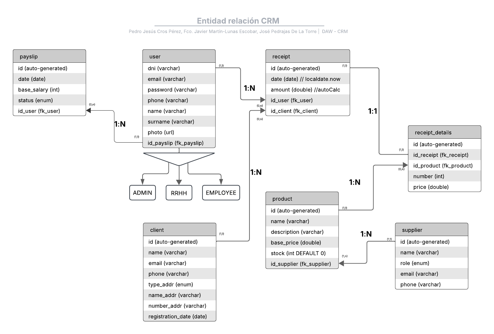

# CRM

[Historial de cambios](./CHANGELOG.md)

## Descripción
El proyecto va a ser un CRM, un CRM (Customer Relationship Management) es un 
sistema que gestiona y optimiza las relaciones e interacciones de una empresa 
con sus clientes. En nuestro CRM gestionaremos los empleados, sus nóminas, 
los clientes y sus facturas.

## Miembros del equipo
- [Francisco Javier Martín-Lunas Escobar](https://github.com/xavivi8)
- [Pedro Jesús Cros Pérez](https://github.com/pjcp0005)
- [José Pedrajas De La Torre](https://github.com/jpt00012)

## Url de la aplicación
Email del usuario: jmartinlunasescobar@gmail.com
Contraseña del usuario: 1234
- Francisco Javier Martín-Lunas Escobar
  - [Pagina](http://35.188.206.158/)
- Pedro Jesús Cros Pérez
  - [Pagina](http://34.133.224.82/)
- José Pedrajas De La Torre
  - [Pagina](http://34.16.53.60/)

## Propuesta preliminar de historias de usuario

### Facturas

El usuario correspondiente podá ver el listado de facturas, en la 
vista podrá hacer:

- Ver la factura
- Enviar la factura
- Descargar la factura
- Añadir una factura
- Eliminar una factura

### Empleados

El usuario correspondiente podrá ver un listado de empleados, en la 
vista podrá hacer:

- Editar el usuario (solo con el rol `Admin o RRHH`)
- Buscar empleado
- Añadir empleado (solo con el rol `Admin o RRHH`)

### Nóminas

El usuario podrá ver su nomina y el usuario correspondiente (`Admin o RRHH`) podra 
hacer: 

- Editar nomina

### Artículos

El usuario correspondiente podrá ver un listado de artículos, en 
la vista podrá hacer:

- Aumentar o disminuir la cantidad de artículos
- Editar los artículos
- Eliminar los artículos
- Buscar artículos
- Añadir artículos

### Login

El usuario podrá iniciar sesión con su correo y contraseña. Podrá 
ver y dejar de ver su contraseña

### Menu

El usuario podrá navegar en el menu y al darla a alguna opción se 
cargaría a la derecha del menu la vista corresponidente

## Diagrama ER

