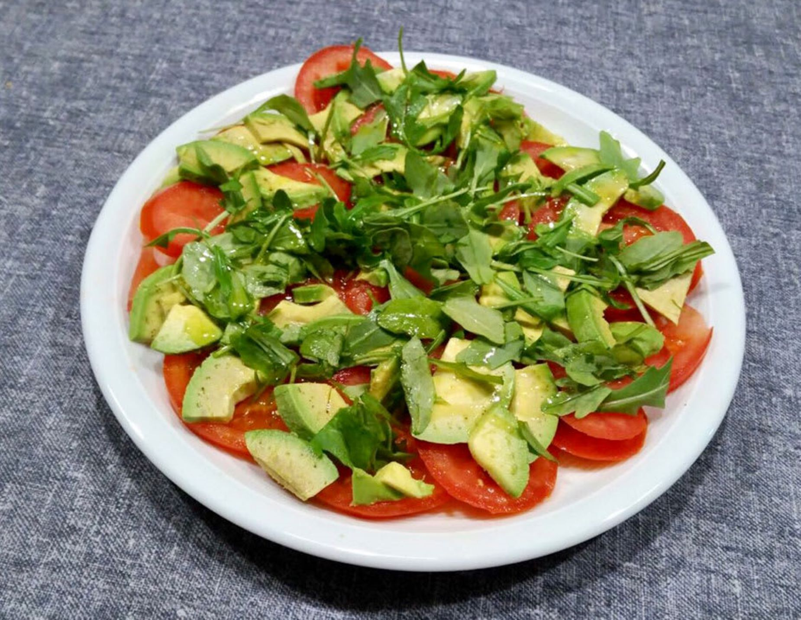
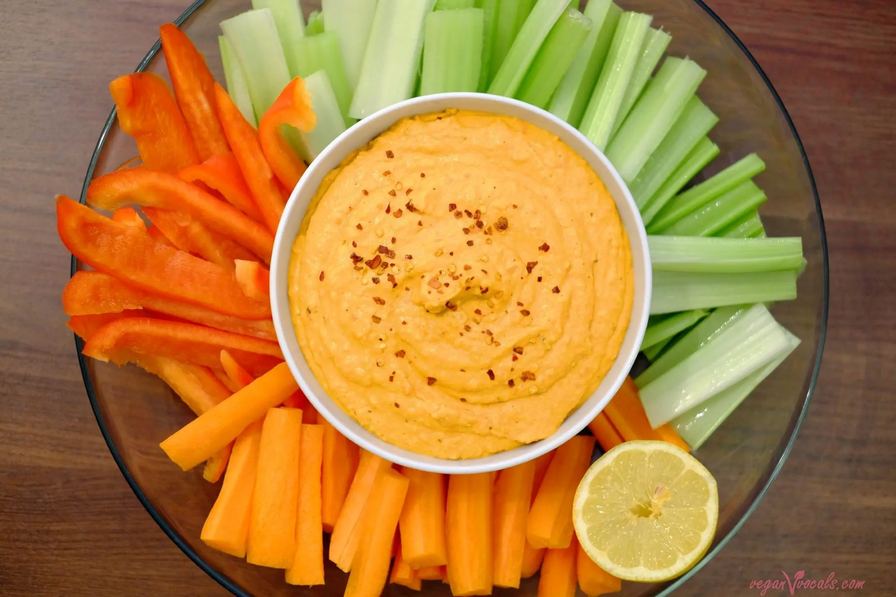
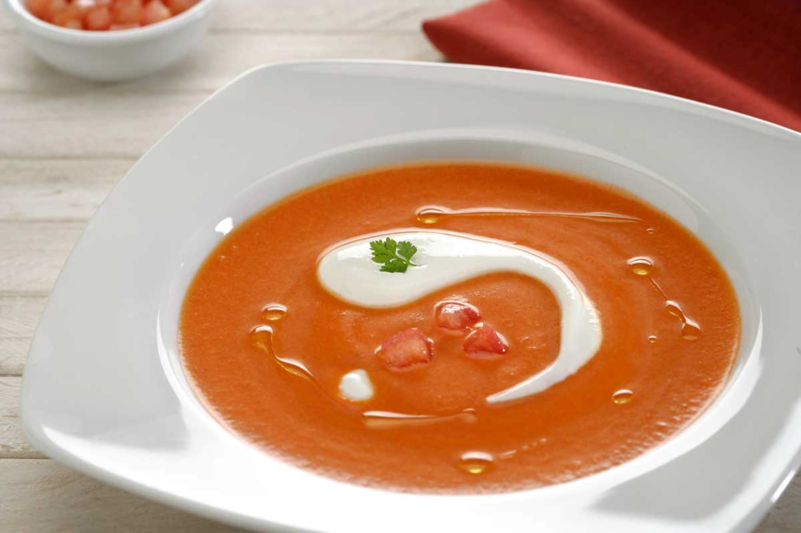

# 🥗 Entrantes

  <a href="../" class="boton-volver">
    Volver a Recetas
  </a>

Una selección ligera para comenzar con buen sabor. Haz clic en cada receta para descubrir los ingredientes y su preparación.

---

<a href="./Ensalada/">
  
  <h3>Ensalada de tomate y aguacate</h3>
</a>

<a href="./Hummus/">
  
  <h3>Hummus casero con crudités</h3>
</a>

<a href="./Sopa/">
  
  <h3>Sopa fría de tomate y yogur</h3>
</a>

