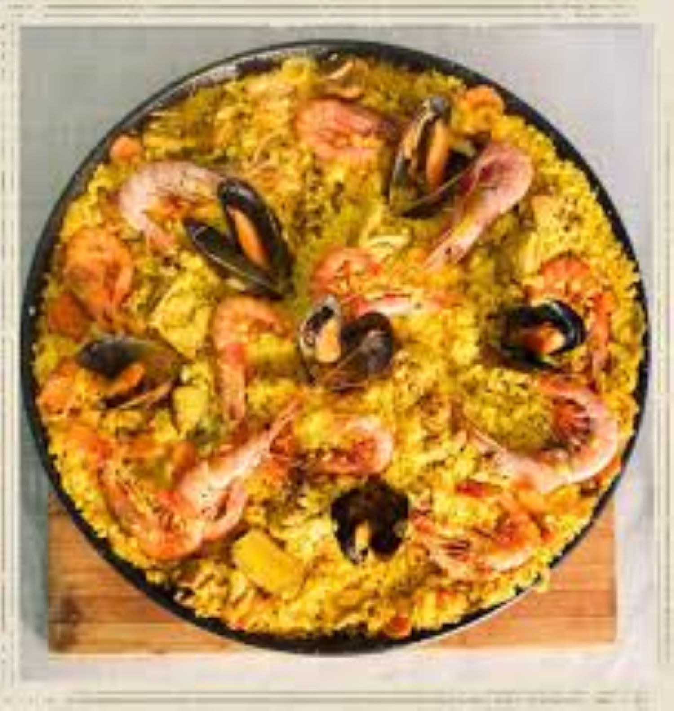

# Paella de mariscos

  <a href="../" class="boton-volver">
    Volver a Platos principales
  </a>

---

::: tip Ingredientes
- 400 g de arroz de grano corto (tipo bomba)
- 1 litro de caldo de pescado
- 200 g de calamares limpios
- 200 g de gambas peladas
- 150 g de mejillones
- 1/2 pimiento rojo
- 1 tomate maduro
- 2 dientes de ajo
- 1 cebolla pequeña
- Hebras de azafrán (o colorante)
- Aceite de oliva virgen extra
- Sal y pimienta al gusto
- Limón para servir
  :::

---

## 👨‍🍳 Preparación

1. Calentar el aceite en una paellera y sofreír la cebolla, el ajo y el pimiento picados.
2. Añadir el tomate rallado y cocinar unos minutos hasta que se reduzca.
3. Incorporar los calamares troceados y saltear hasta que cambien de color.
4. Añadir el arroz y remover bien para que se impregne de los sabores.
5. Verter el caldo caliente (previamente infusionado con el azafrán) y ajustar de sal.
6. Distribuir las gambas y los mejillones por encima, sin remover más.
7. Cocinar a fuego medio-alto 10 minutos, luego bajar el fuego y cocinar 8 minutos más.
8. Retirar del fuego, cubrir con un paño limpio y dejar reposar 5 minutos.
9. Servir con gajos de limón.

---

## 💡 Consejos

Si quieres un fondo más intenso, puedes añadir una cucharadita de ñora o pimentón dulce al sofrito. También puedes decorar con perejil fresco picado.

---
📌 *Receta elaborada para nuestro recetario digital con ❤️*