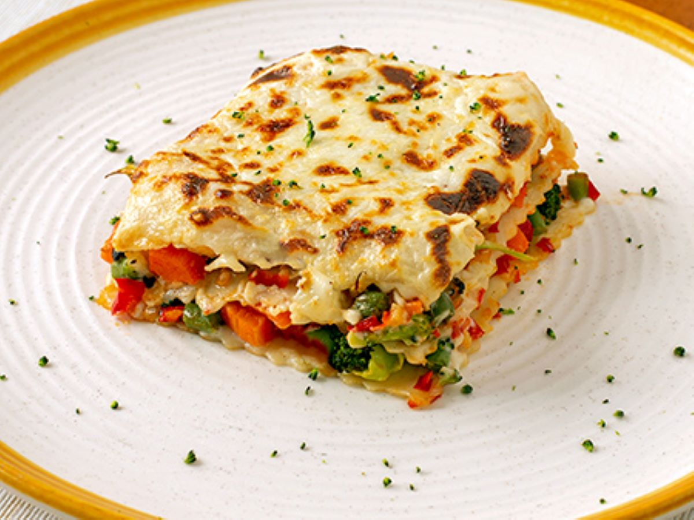
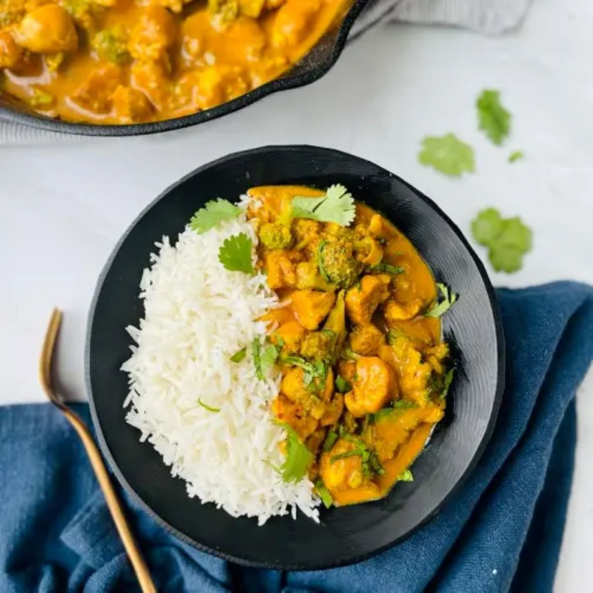

# 🍽️ Platos principales

Una selección de platos sustanciosos y llenos de sabor. Ideales para compartir en familia o sorprender en una comida especial.  
Haz clic en cualquier tarjeta para ver la receta completa.

---

  <a href="../" class="boton-volver">
    Volver a Recetas
  </a>

<a href="Lasania/">
  
  <h3>Lasaña vegetal</h3>
</a>

<a href="./Pollo/">
  
  <h3>Pollo al curry con arroz basmati</h3>
</a>

<a href="./Paella/">
  
  <h3>Paella de mariscos</h3>
</a>

