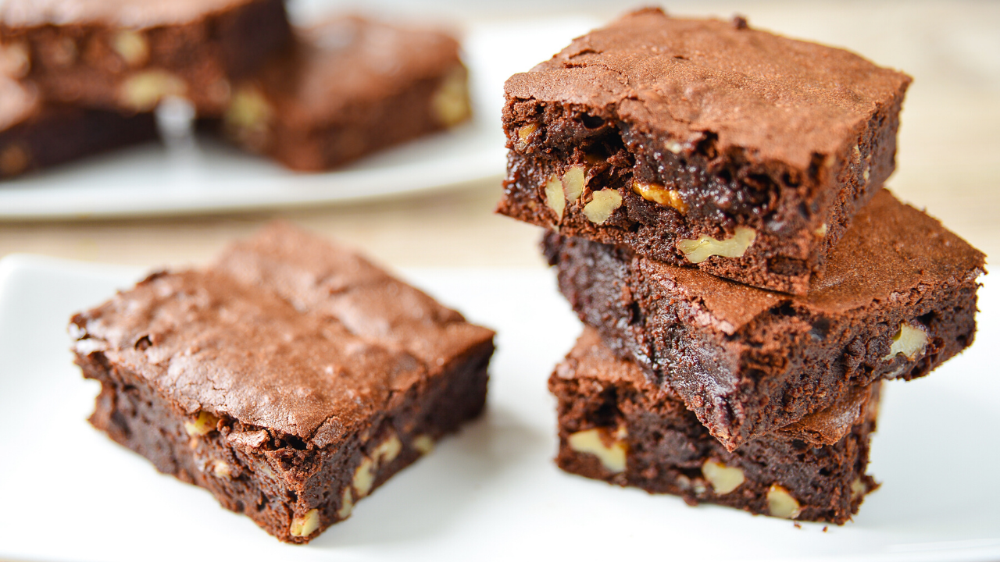

# Brownies con chocolate y nueces

  <a href="../" class="boton-volver">
    Volver a Postres
  </a>

> Un bocado intenso, húmedo y crujiente. El equilibrio perfecto entre lo goloso y lo reconfortante.

---

::: tip Ingredientes
- 200 g de chocolate negro
- 100 g de mantequilla
- 150 g de azúcar
- 3 huevos
- 100 g de harina
- 1 cucharadita de extracto de vainilla
- 100 g de nueces troceadas
  :::

---

## 👨‍🍳 Preparación

1. Derrite el chocolate con la mantequilla al baño maría o en microondas.
2. Bate los huevos con el azúcar y la vainilla hasta que espumen.
3. Incorpora el chocolate derretido.
4. Añade la harina tamizada y mezcla con suavidad.
5. Agrega las nueces y vierte la mezcla en un molde engrasado.
6. Hornea a 180ºC durante 25-30 minutos.
7. Deja enfriar antes de cortar en porciones.

---

## 💡 Consejos

Si los enfrías en la nevera, su textura se vuelve aún más densa y deliciosa.

---
📌 *Receta elaborada para nuestro recetario digital con ❤️*
