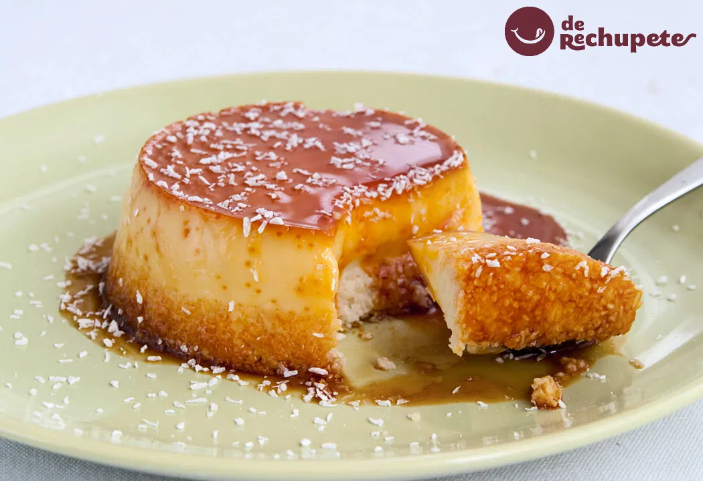

# Flan de coco

  <a href="../" class="boton-volver">
    Volver a Postres
  </a>

> Un postre suave y aromático que combina el dulzor del flan con el sabor tropical del coco.

---

::: tip Ingredientes
- 1 lata de leche condensada
- 1 lata de leche de coco
- 3 huevos
- 1 cucharadita de esencia de vainilla
- Caramelo líquido
  :::

---

## 👨‍🍳 Preparación

1. Precalienta el horno a 180ºC.
2. Bate los huevos con la leche condensada, leche de coco y vainilla.
3. Vierte el caramelo líquido en el fondo de un molde.
4. Agrega la mezcla encima y cubre con papel de aluminio.
5. Hornea al baño maría durante 50-60 minutos.
6. Deja enfriar y refrigera al menos 4 horas antes de desmoldar.

---

## 💡 Consejos

Puedes decorar con coco rallado tostado por encima al servir.

---
📌 *Receta elaborada para nuestro recetario digital con ❤️*
